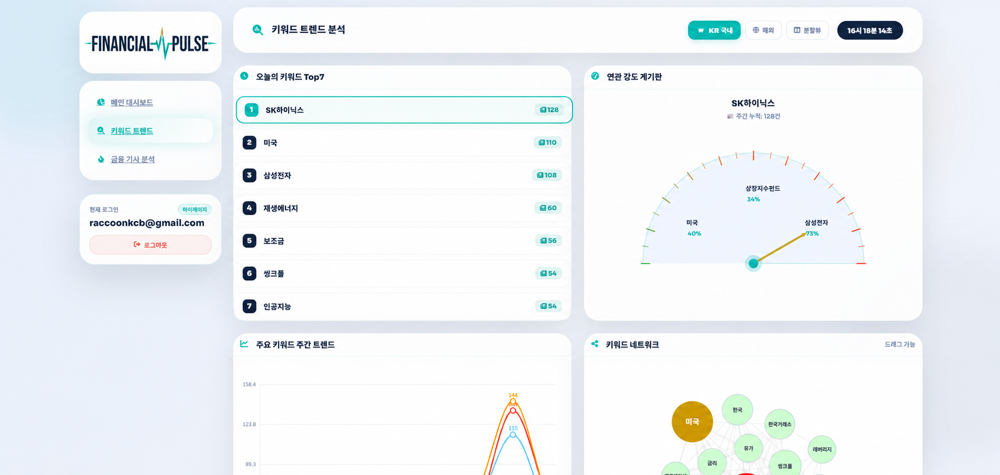

# 📊 Finance Pulse (금융박동) - 금융 뉴스 기반 거시적 시장 심리 대시보드

> **"금융 뉴스로 시장의 맥박을 읽다."**

본 프로젝트는 한국 및 해외의 방대한 경제 뉴스 데이터를 실시간 배치로 수집하고, 금융 도메인 특화 AI 모델(FinBERT)과 자체 구축한 NER(개체명 인식) 파이프라인을 통해 시장의 거시적 투자 심리 추세와 섹터별 긍·부정 흐름을 직관적으로 시각화하는 **AI 기반 금융 데이터 엔지니어링 프로젝트**입니다.

---

## 나의 담당 역할 (My Role)
**팀 내 포지션: ML & Data Processing Engineer**
* **전체적인 데이터 크롤링 설계 담당.**
* **데이터 처리 환경을 위한 ES 스키마 설계.**
* **금융 특화 자연어 처리(NLP) 파이프라인 전담:** 한국어/영어 뉴스 데이터 감성 분석 및 7대 섹터 Zero-shot 분류 모델 구축.
* **고순도 데이터 정제 및 자체 NER 사전 구축:** 위키피디아 덤프 파싱을 통한 자체 금융 개체명 사전(기업/인물) 구축 및 `TextAnalyzer` 모듈 개발. 일반 명사와의 중의성 충돌 문제 제어.
* **데이터 자원 및 인프라 최적화:** 제한된 하드웨어 환경(gpu 1060, cpu i7-7700K)을 고려하여 거대한 분석 스크립트를 기능별 독립 모듈로 분리 설계하고, 가비지 컬렉션(GC)을 명시적으로 제어하여 시스템 안정성 확보.
* **PPT 작성 및 발표.** 

---

## 1. 프로젝트 요약 (Overview)
* **팀명:** 금융박동
* **개발 기간:** 2026년 5월 ~ 2026 6월
* **핵심 타겟:** 정보의 비대칭성 및 파편화된 뉴스 속에서 거시적인 투자 심리 흐름을 직관적으로 파악하고자 하는 스마트 개인 투자자 및 자산 관리자.
* **주요 기능:**
  * **[담당 파트]** 한국(네이버 금융, 한국경제)/해외 경제 뉴스 대량 실시간 배치 크롤링
  * **[담당 파트]** 자체 NER 파이프라인(`TextAnalyzer`) 기반 핵심 키워드 정규화 및 추출
  * **[담당 파트]** FinBERT / KR-FinBERT 기반 금융 감성 분석 (Sentiment Analysis)
  * **[담당 파트]** Zero-shot Classification 기반 뉴스 7대 섹터 자동 분류
  * Elasticsearch 역색인을 활용한 형태소 전문 검색 및 대시보드 실시간 집계(Aggregation)
 
  * 

---

## 2. 기술 스택 (Technical Stacks)

### My Main Stacks (AI & Data Pipeline)
* **AI & NLP:** `Hugging Face Transformers`, `ProsusAI/finbert`, `snunlp/KR-FinBERT-SC`, `BART-large-MNLI`
* **Text Analysis & NER:** Python `kiwipiepie` (형태소 분석), `KeyBERT`, 자체 구축 정규화 사전
* **Data Engineering:** `Python`, `queue.Queue` & `threading` (멀티스레드 동시성 제어)

### Team & Infrastructure Stacks
* **Storage & Search Engine:** Elasticsearch, MariaDB
* **Backend Framework:** FastAPI 
* **Web Scraping:** Selenium WebDriver, BeautifulSoup4, Requests
* **DevOps & Network:** Linux (Ubuntu), Crontab, Cloudflare Tunnel, Tailscale (가상 네트워크 보안)

---

## 3. 핵심 문제 해결 경험 (Trouble Shooting)

### 3.1. 동적 토픽 모델링의 한계 극복 및 자체 분류 모델 구축 (Labeling)
* **문제 발생:** 초기 뉴스 대주제 분류를 위해 비지도 학습 기반의 토픽 모델링을 도입했으나, 모델 업데이트 시마다 군집화되는 토픽이 전면 변동되어 고정된 카테고리가 필요한 실제 서비스에 부적합함.
* **해결 방안:** 토픽 모델링을 폐기하고 서비스에 적합한 7개의 대주제(Sector)를 직접 정의함. 이후 크롤링한 뉴스 데이터에 고성능 LLM(Gemini API) 제로샷(Zero-shot) 라벨링을 적용하여 고순도의 학습용 데이터 셋을 자체 구축하고, 이를 바탕으로 가벼운 맞춤형 분류 모델을 생성하여 라벨링 파이프라인에 적용함.
* **결과:** 모델 업데이트에 따른 토픽 변동 문제를 원천 차단하고, 실제 서비스 환경에 적합한 안정적이고 일관된 뉴스 섹터 자동 분류 시스템을 완성함.

### 3.2. 하이브리드 키워드 추출 및 위키피디아 덤프 기반 자체 NER 사전 구축
* **문제 발생:** 키워드와 개체명(기업/인물/지역) 추출을 위해 초기 적용한 무거운 NER 모델과 KeyBERT는 연산 소요 시간이 길고, 금융과 무관한 일반 명사 등 불순물을 대거 추출하는 심각한 데이터 오염(Noise)을 유발함. 또한 상용 서비스 수준의 정규화를 위해서는 방대한 별칭(Alias)을 커버할 고도화된 사전이 필수적이라고 판단.
* **해결 방안:** 형태소 분석기(Kiwi, spaCy)로 1차 명사 후보군을 빠르게 추출한 뒤, FinBERT 임베딩 및 코사인 유사도 분석을 통해 문맥에 맞는 핵심 키워드만 엄선하는 하이브리드 방식을 구축함.
* 

지역명은 직접 수동 사전을 구축했고, 기업/인물명은 API 호출 제한을 극복하고자 위키피디아 덤프(Dump) 파일을 직접 내려받아 파싱함. 위키 데이터 내 무분별한 별칭 오염을 막기 위해 1글자 단어 제외 및 대표명 우선 매핑 등 강력한 필터링 로직을 적용함.

* **결과:** 무거운 모델에 의존하지 않고 추출 속도와 키워드 순도를 비약적으로 높임. 나아가 미등록 단어 후보군을 추출해 관리자 화면에서 승인 및 사전에 추가하는 확장형 로직까지 설계하여 상용화 수준의 데이터 파이프라인 기반을 다짐.

### 3.3. 감성 분석 모델의 극단적 편향성 제어 (Logit 스케일링)
* **문제 발생:** 하드웨어 환경과 결과 품질을 고려해 최적의 감성 분석 모델을 선정했으나, 긍정/부정 이진 분류 위주로 학습된 모델의 태생적 한계로 인해 결과 점수가 극단적으로 양극화되어 튀는 현상이 발생함.
* **해결 방안:** 모델이 출력하는 최종 확률값 대신, 은닉층의 원시 데이터인 로짓(Logit) 값을 직접 추출함. 긍정과 부정 로짓의 차이를 구한 뒤 시그모이드(Sigmoid) 함수를 통과시켜 점수를 부드럽게 보정하는 자체 수학적 후처리 로직을 도입함.
* **결과:** 이분법적 분류 모델의 근본적인 한계를 완벽히 제거할 수는 없었으나, 점수가 극단적으로 치우치는 현상을 효과적으로 제어하여 대시보드에 0~100점의 보다 안정적인 거시적 심리 지표를 제공하게 됨.

---

## 4. 데이터 수집 가드레일 및 어드민 복구 전략
무차별적인 크롤링으로 인한 IP 차단 리스크를 최소화하고 데이터 신뢰성을 보장하기 위해 고도화된 수집 가드레일을 운영.

* **수집 필터 가드레일:** 기사의 정제된 `URL + Title` 문자열 기반으로 **MD5/SHA 고유 해시 ID(`doc_id`)** 생성. ES 존재 여부를 체크하여 중복 뉴스는 사전 스킵(Skip).
* **품질 필터링:** 본문 길이 미달 또는 정제 패턴 유효성(`NewsCleaner`)을 충족하지 못하는 기사는 적재 탈락 처리.
* **어드민 로그 기반 수동 복구:** 탈락된 기사는 원시 로그 형태로 백엔드에 저장되며, 어드민 화면에서 에러 로그 확인 후 **[재크롤링 버튼]**을 통해 일시적 바이패스 및 강제 정제 적재를 지원.

---

## 5. 시스템 설정 및 비즈니스 로직
* **동적 시간 범위 계산 (Time-Windowing):** 크롤링 스케줄 기반으로 가장 최근 수집 완료 시점을 역산하여 정확히 **과거 24시간 동안의 데이터 범위**를 리턴, 공백 없는 대시보드 렌더링 보장.
* **수익화 로드맵:** 1. 금융 상품 타겟팅 및 플랫폼 배너 광고
  2. 고액 자산가용 프리미엄 구독제(SaaS) 도입
  3. 정제 가공된 섹터별 감성 지수 API B2B 판매 (Alternative Data)
